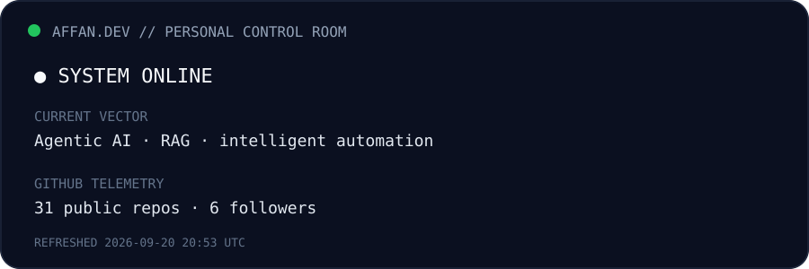

# AFFAN KHAN
### `Computer Engineer` · `AI / ML` · `Full Stack` · `Flutter`

---

<table>
<tr>
<td width="52%" valign="top">

## ◉ SYSTEM STATUS

</td>
<td width="48%" valign="top">

## ◈ CURRENT VECTOR

> **Build software that feels intelligent.**
>
> I’m exploring AI agents, retrieval systems, document intelligence and automation — while continuing to ship full-stack and mobile products.

**Based in:** Pune, India  
**Education:** B.Tech Computer Engineering · VIIT Pune  
**Open to:** Software Engineering · AI/ML · Full Stack

</td>
</tr>
</table>

## `whoami`

I’m a Computer Engineering student who likes building beyond tutorials: compilers, AI agents, voice-driven billing, mobile apps, analytics pipelines and production-style web systems.

My current direction is **AI-powered software engineering** — especially systems that combine LLMs with retrieval, tools, APIs and real business workflows.

---

## ◈ PROJECT CONSTELLATION

<table>
<tr>
<td width="33%" valign="top">

### ◆ AI / AGENTS

**[Enterprise Document Intelligence Agent](https://github.com/affanSkhan/Enterprise-Document-Intelligence-Agent)**  
Document ingestion, RAG and multi-agent workflows.

**[AI Interview Coach](https://github.com/affanSkhan/ai_interview_coach)**  
AI-assisted interview preparation.

**[Fake News Detection Chatbot](https://github.com/affanSkhan/Fake-News-Detection-Chatbot)**  
NLP + conversational interface.

**[AI Job Role Recommender](https://github.com/affanSkhan/ai-job-role-recommender)**  
Skill-driven role recommendation.

</td>
<td width="33%" valign="top">

### ◆ PRODUCTS

**[Kirana Voice Bill](https://github.com/affanSkhan/kirana-voice-bill)**  
Voice-first billing workflow for local commerce.

**[CIE Exam App](https://github.com/affanSkhan/CIE-Exam-App-VIT)**  
Flutter-based academic application.

**[Agri-Vani](https://github.com/affanSkhan/Agri-Vani)**  
Technology for agriculture-focused workflows.

**[Movie Booking](https://github.com/affanSkhan/movie-booking-app)**  
Real-time seat locking and booking architecture.

</td>
<td width="33%" valign="top">

### ◆ ENGINEERING

**[MiniC Compiler](https://github.com/affanSkhan/minic_compiler)**  
Lexer → parser → AST → semantics → IR → VM.

**[Predictive Maintenance](https://github.com/affanSkhan/predictive-maintenance-system)**  
ML-driven industrial maintenance workflow.

**[Sales Analytics Pipeline](https://github.com/affanSkhan/gm_sales_analytics_pipeline)**  
Analytics + data engineering pipeline.

**[Empire Spare Parts](https://github.com/affanSkhan/empire-spare-parts-website)**  
Production client website.

</td>
</tr>
</table>

<strong>⌁ EXPAND: selected architecture notes</strong>

| System | What it demonstrates |
|---|---|
| Enterprise Document Intelligence | Python · LangChain · CrewAI · RAG · ChromaDB · FastAPI |
| MiniC Compiler | Modern C++ · lexical analysis · recursive descent · IR · bytecode · VM |
| Movie Booking | React · Express · PostgreSQL · WebSockets · Razorpay |
| Kirana Voice Bill | Voice interaction · business automation · billing workflow |
| Sales Analytics | Data pipelines · DuckDB · Streamlit · BigQuery/GCP concepts |

---

## `./stack --active`

`AI Agents` · `RAG` · `LLMs` · `Python` · `TypeScript` · `React` · `Next.js` · `Flutter` · `FastAPI` · `PostgreSQL` · `Docker`

---

## ◈ LIVE TELEMETRY

---

## ◉ ACTIVITY FEED

---

## `./contact --open`

<table>
<tr>
<td>◆ <a href="https://affan.tech">affan.tech</a></td>
<td>◆ <a href="https://www.linkedin.com/in/affansakhan/">LinkedIn</a></td>
<td>◆ <a href="https://leetcode.com/u/Affan_Khan_07/">LeetCode</a></td>
<td>◆ <a href="mailto:khanaffan070@gmail.com">Email</a></td>
</tr>
</table>

---

### `BUILD → MEASURE → LEARN → SHIP`

